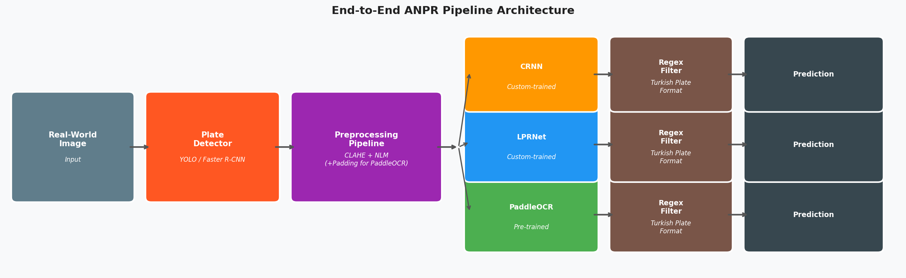

# Turkish License Plate Recognition (ANPR) System

This repository contains the code, models, and experimental pipeline for the research project: **"The Effect of Image Preprocessing on OCR Models for License Plate Recognition"**.

The project investigates how image preprocessing (CLAHE + Non-Local Means Denoising) impacts the performance of various Optical Character Recognition (OCR) models in an end-to-end Automatic Number Plate Recognition (ANPR) system tailored for Turkish license plates.

## 🚀 Project Overview

A standard ANPR pipeline consists of plate localization followed by OCR. This study explores whether domain-specific preprocessing consistently improves OCR accuracy across different architectures. 

- **Detectors:** YOLOv8 and Faster R-CNN
- **OCR Engines:** 
  - **PaddleOCR** (Pre-trained, Zero-shot generalization)
  - **LPRNet** (Custom-trained from scratch)
  - **CRNN** (Custom-trained from scratch)
- **Dataset:** A curated Turkish License Plate Dataset containing 2,003 labeled images, evaluated using 3-fold cross-validation.

## 📂 Repository Structure

- `CRNN_train/` - Training scripts, architecture definitions, and evaluation metrics for the custom CRNN model.
- `LPRNet_train/` - Training scripts, architecture definitions, and evaluation metrics for the custom LPRNet model.
- `yolo_train/` - YOLOv8 training and inference scripts for plate detection.
- `faster-RCNN_train/` - Faster R-CNN training and inference scripts for plate detection.
- `veri_hazirlama/` - Data preprocessing, cleaning, and formatting scripts.
- `experiment/` - End-to-end evaluation orchestration, presentation generation, and final figures/plots.
- `final_report.md` - The comprehensive academic report detailing the methodology, results, and literature review.

## ⚙️ Preprocessing Pipeline

To mitigate real-world ANPR challenges (motion blur, low illumination, artifacts), the following preprocessing pipeline is applied before the OCR stage:

1. **CLAHE (Contrast Limited Adaptive Histogram Equalization):** Applied on the L-channel of the LAB color space to enhance local contrast without over-amplifying noise.
2. **NLM Denoising (Non-Local Means):** Preserves structural edges of characters while suppressing JPEG artifacts and sensor noise.
3. **White Padding (Extended Pipeline):** A 10-pixel white border added specifically for PaddleOCR to prevent edge character clipping.

## 📊 Key Results

### Isolated OCR Performance (Training)
LPRNet demonstrated highly stable and superior performance compared to CRNN when trained on the isolated plate dataset:
- **LPRNet:** 86.10% Exact Match | 2.27% Character Error Rate (CER)
- **CRNN:** 48.83% Exact Match | 11.53% Character Error Rate (CER)

### End-to-End Pipeline Evaluation
Tested on a real-world set of 40 images with full detector-OCR pipelines:
1. **Faster R-CNN + PaddleOCR:** 62.5% Exact Match (Top Performer)
2. **YOLOv8 + PaddleOCR:** 55.0% Exact Match
3. **YOLOv8 + LPRNet:** 52.5% Exact Match
4. **Faster R-CNN + LPRNet:** 50.0% Exact Match
5. **YOLOv8 / Faster R-CNN + CRNN:** ~10% Exact Match (Suffered from domain-shift collapse)

*Finding:* Preprocessing benefits are highly architecture-dependent. Large-scale pre-training (PaddleOCR) combined with domain-specific preprocessing (padding + CLAHE + NLM) outcompeted custom-trained models in the end-to-end setting.

## 👤 Author
**Mustafa Uğur Karaköse**  
Department of Computer Engineering  
*Image Processing Final Report 2026*
